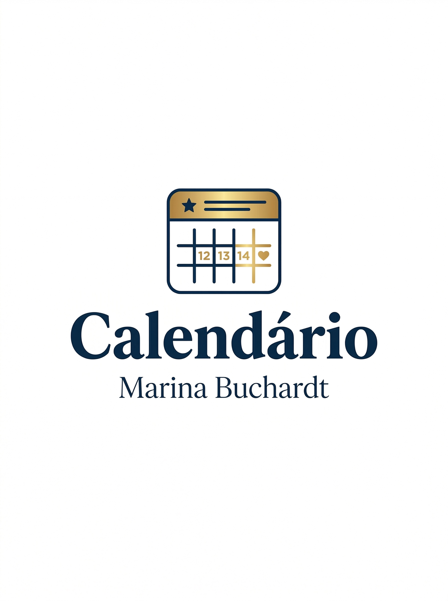

# 📅 Marina Buchardt — Calendário Corporativo Premium

Sistema web moderno e elegante para **gestão de eventos internos**, desenvolvido com foco em organização empresarial, produtividade e experiência visual refinada.

Este projeto foi criado como iniciativa pessoal para centralizar compromissos, reuniões e ações por departamento em um calendário interativo, com interface premium e backend próprio.

---

## ✨ Visão Geral

O **Marina Buchardt Calendário** é uma aplicação full stack desenvolvida com:

- **Python + Flask** no backend
- **SQLite** como banco de dados leve e eficiente
- **HTML5 + CSS3 + JavaScript Vanilla** no frontend
- **PWA (Progressive Web App)** com suporte offline
- **Deploy em nuvem com Gunicorn**

Ideal para uso interno em empresas, setores administrativos ou controle organizacional.

---

## 🖼️ Prévia do Projeto

<p align="center">
  
</p>


---

## 🚀 Funcionalidades

### 📌 Gestão de Eventos
- Criar novos eventos
- Excluir eventos existentes
- Organizar por data e horário
- Descrição, local e duração

### 🏢 Departamentos Coloridos
Cada setor possui identidade visual própria:

- Produção
- Logística
- Administrativo
- RH
- Comercial
- Enfermaria

### 📆 Calendário Inteligente
- Navegação entre meses
- Destaque do dia atual
- Contagem mensal de eventos
- Visualização rápida por clique

### 🎨 Interface Premium
- Tema dark sofisticado
- Efeitos glassmorphism
- Tipografia elegante
- Micro animações suaves

### 📱 Progressive Web App
- Instalável no celular ou desktop
- Funciona offline
- Service Worker ativo
- Ícone personalizado

---

## 🧠 Tecnologias Utilizadas

| Tecnologia | Função |
|-----------|--------|
| Python | Backend |
| Flask | API REST |
| SQLite | Banco de Dados |
| Gunicorn | Produção |
| HTML5 | Estrutura |
| CSS3 | Design |
| JavaScript | Interações |
| PWA | Instalação Offline |

---

## 📂 Estrutura do Projeto

```bash
marina-calendario/
│── app.py
│── requirements.txt
│── eventos.db
│── templates/
│   └── index.html
│── static/
│   ├── style.css
│   ├── script.js
│   ├── manifest.json
│   ├── sw.js
│   └── calendario_marina_logo.png
⚙️ Como Rodar Localmente
git clone https://github.com/seuusuario/seurepositorio.git

cd seurepositorio

pip install -r requirements.txt

python app.py

Acesse:

http://localhost:5000
🔒 Aviso Importante

Este é um projeto pessoal e privado, disponibilizado apenas como portfólio e demonstração técnica.

📌 No momento não está liberado para uso, redistribuição, cópia ou implementação por terceiros.

Todos os direitos reservados ao autor.

🎯 Objetivo do Projeto

Este sistema foi criado para evoluir habilidades em:

Desenvolvimento Full Stack
UX/UI aplicado a sistemas reais
Estruturação de APIs
Banco de dados local
Deploy profissional
Criação de SaaS futuros
👤 Autor

Bruno David de Oliveira Buchardt

Desenvolvedor focado em criar soluções modernas, úteis e com identidade visual forte.

📌 Status

🟢 Projeto funcional
🟡 Em constante evolução
🔒 Uso privado no momento

⭐ Observação Final

